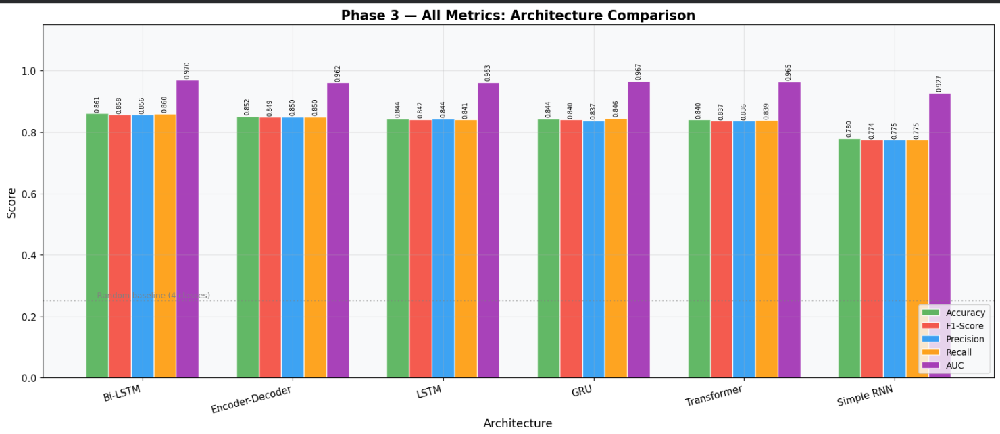
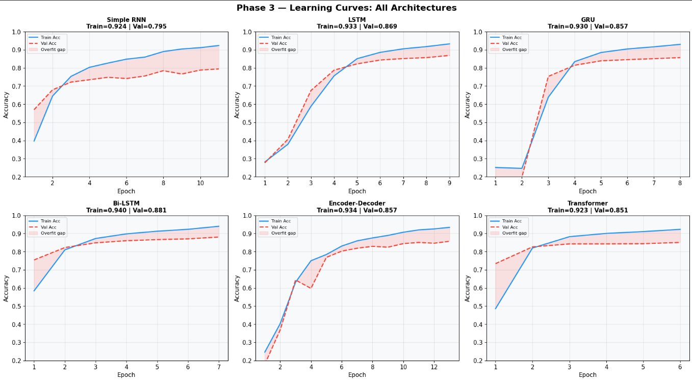
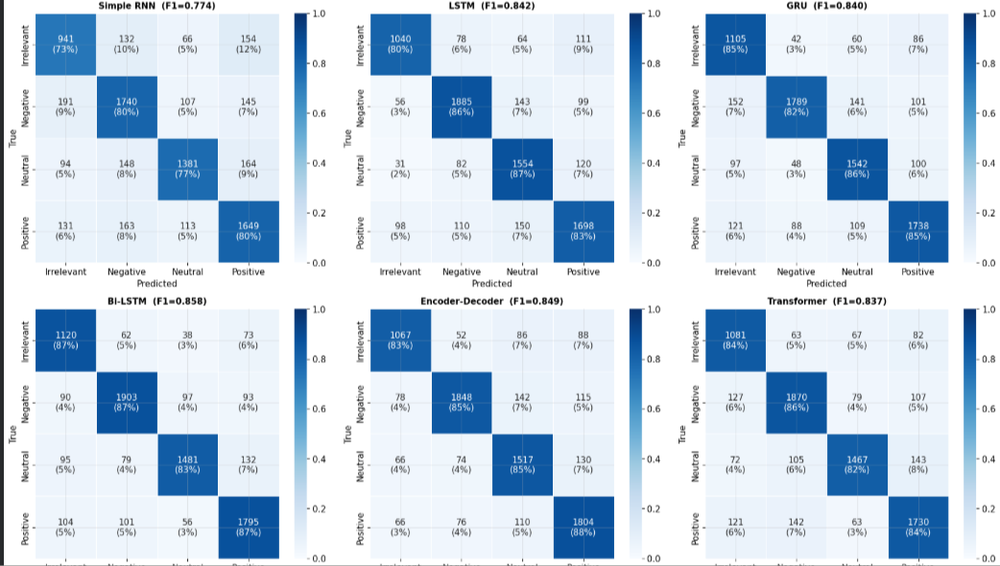
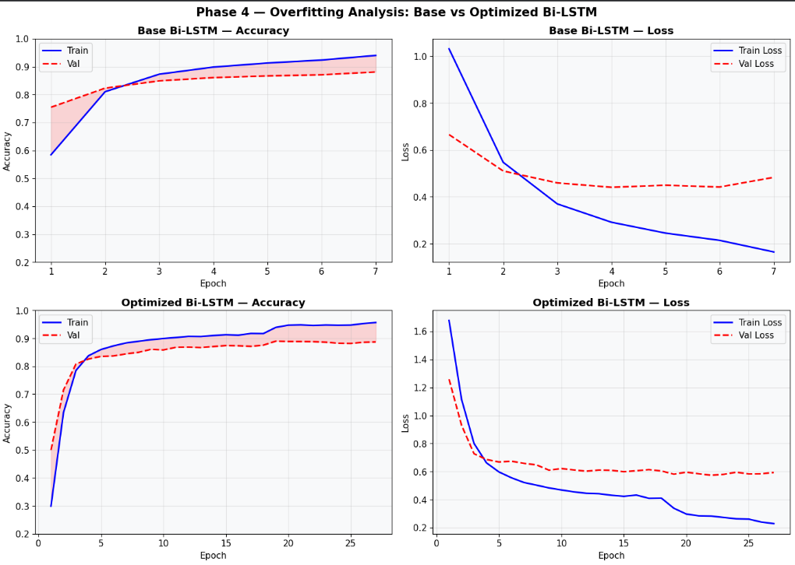
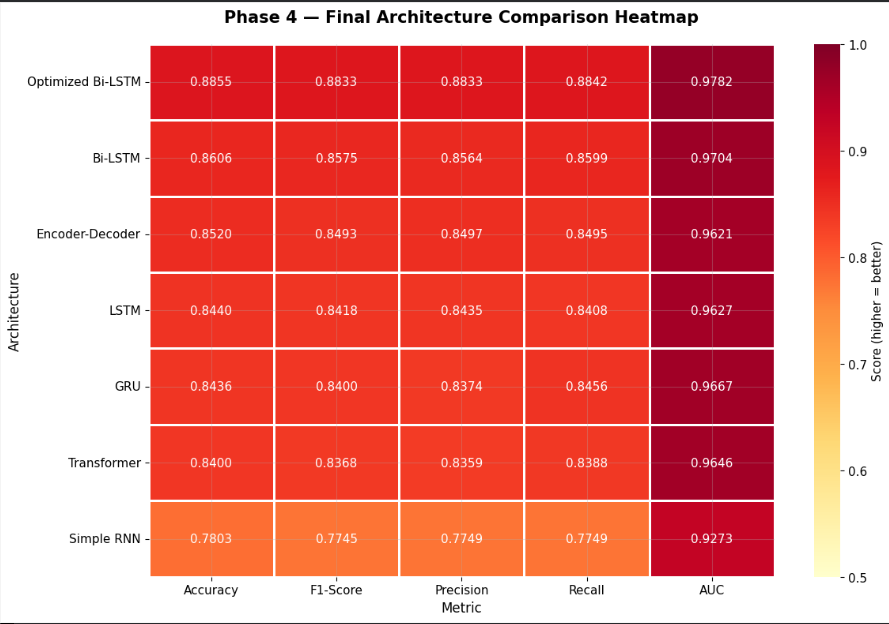
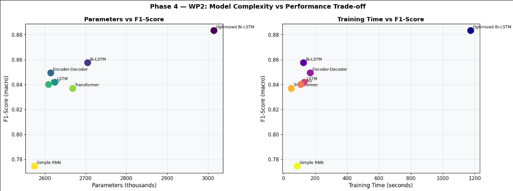

# Twitter Sentiment Analysis — Deep Learning Comparison

Compared 6 deep learning architectures for 4-class sentiment classification on Twitter data.
Best model: Bi-LSTM at 86.2% accuracy and 0.97 AUC.


**
**What this project does

Given a tweet, the model predicts one of 4 sentiment classes: Positive, Negative, Neutral, or Irrelevant.

The interesting part is the comparison — instead of just building one model, I trained and evaluated 6 different architectures side by side to see which one works best for Twitter sentiment and why. Each architecture has a specific reason for being included:

- **Simple RNN** — baseline, proves vanishing gradient problem experimentally
- **LSTM** — fixes vanishing gradient with 3 gates (input, forget, output)
- **GRU** — same idea as LSTM but 2 gates, ~25% fewer parameters
- **Bi-LSTM** — reads tweet both left-to-right and right-to-left, best for negations
- **Encoder-Decoder** — compresses the tweet into a bottleneck vector, then classifies
- **Transformer** — self-attention, every word looks at every other word simultaneously
- 
** Results**

| Model | Accuracy | F1-Score | AUC |
|---|---|---|---|
| Simple RNN | baseline | — | — |
| LSTM | ~83% | ~0.83 | ~0.95 |
| GRU | 84.08% | 0.8368 | 0.9657 |
| Bi-LSTM | **86.17%** | **0.8589** | **0.9716** |
| Encoder-Decoder | ~80% | — | — |
| Transformer | ~85% | ~0.85 | ~0.97 |

Bi-LSTM won because Twitter has short, negation-heavy tweets — bidirectional context matters more than self-attention on short sequences.

**Visualizations**













**Dataset**

Twitter Entity Sentiment Analysis dataset from Kaggle.
- 4 classes: Positive, Negative, Neutral, Irrelevant
- Split: 70% train / 20% validation / 10% test
- Preprocessing: lowercase, URL removal, negation preservation, lemmatization, padding to 50 tokens


**Key engineering decisions**

- `SpatialDropout1D` instead of regular Dropout after embedding — drops entire word dimensions, not random values
- Removed `recurrent_dropout` from all RNN layers — it disables GPU CuDNN kernel, making training 3-5x slower
- Funnel architecture (64→32 units) instead of flat — forces compression, improves generalization
- Class weights applied — dataset is imbalanced across 4 classes
- Optimizer comparison: Adam vs SGD vs RMSprop tested on best model

One interesting bug I fixed: GRU was collapsing to 17% accuracy (random guessing). Root cause was `BatchNormalization` placed between two stacked GRU layers — it normalized across timesteps and corrupted the sequential signal. Moving it to after the final GRU layer fixed it immediately, bringing accuracy from 17% to 84%.

**Running the web app**

```bash
pip install streamlit tensorflow nltk
streamlit run sentiment_app.py
```

You also need `best_sentiment_model.h5` and `tokenizer.pkl` — run the notebook first to generate them, then place them in the same folder as `sentiment_app.py`.

---

**Tech used**

Python, TensorFlow, Keras, NumPy, Pandas, Scikit-learn, Matplotlib, Streamlit, Google Colab
